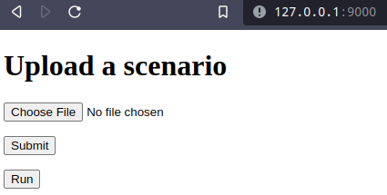
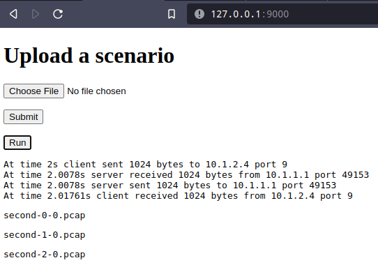

# VANETLAB - Backend

## Spustenie:

 - Treba mat nainstalovany docker
 - Zbuildime docker image prikazom `docker build -t vanetlab-be . `, bude to celkom dlhu chvilu trvat a zrat 100% cpu. nejako to ale musime predychat.
 - spustime image prikazom `docker run -itdp 9000:9000 vanetlab-be:latest`
 - k api sa nasledne dostanes u seba na `127.0.0.1:9000` (nie localhost, lebo nemam este CORS poriesene), ak chces iny port ~~zmen lavu stranu prepinacu `-p`~~ mas zatial smolu sorry, ked bude funkcny FE tak to bude ficat.

## Development setup:

Nainštalujeme si Python < 3.9, kvôli kompatibilite s nástrojom ns-3.

Náš tím používa na vývoj: `python3.6 python3.6-dev python3.6-venv`

Nainštalujeme flask.

Pre spustenie treba zadat tieto ENV variables:

```bash
export NS3_WAF_PATH=/path/na/priecinok/v/ktorom/je/waf
export VANETLAB-BE-PORT=9000
export VANETLAB-BE-HOST=127.0.0.1
```

Taktiez treba upravit konstantu `WEB_URL` na tvar `http://{HOST}:{PORT}` (bez `/` na konci) v subore `app/static/script.js`. Nejde to dynamicky nastavovat nakolko sa to vola z klienta. V buducnosti sa toto bude volat z `vanetlab-fe` aplikacie a nebude to treba reisit.

Samozrejme vsetky hodnoty je mozne upravit podla potreby.

potom už stačí len `python main.py`

## Ako to funguje

Ideme na `localhost:9000`, kde cez `Choose file` tlačidlo načítame `.py` ns3 simulačný scenár.



Stlačíme tlačidlo `Submit`, čím sa odošle na BE, ale ešte sa nevykoná.
Následne stlačíme tlačidlo `Run`, po ktorom sa vykoná scenár a dostaneme output.



Kde klikneme na jeden z `*.pcap` odkazov,  tak si vieme stiahnuť trace file vygenerovaný simuláciou.
